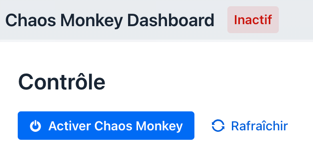
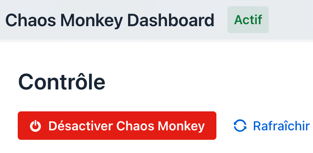
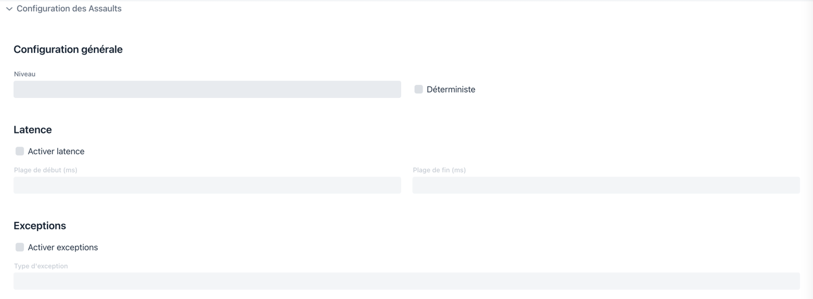
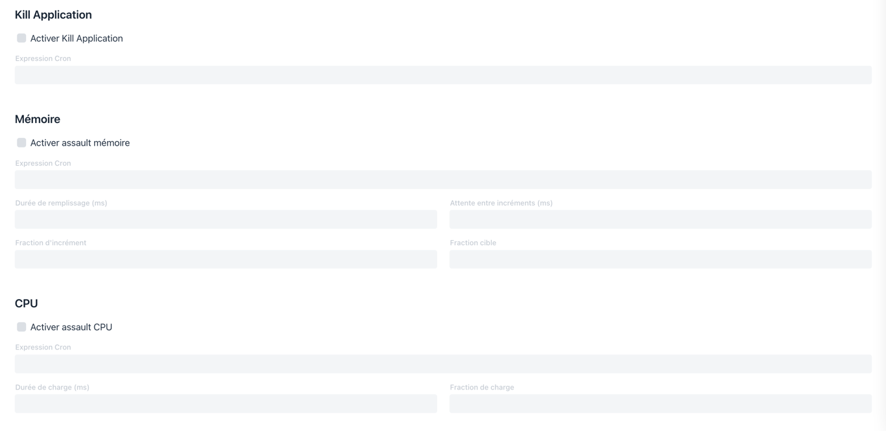

# Interface Chaos Monkey

Interface d'administration pour Chaos Monkey pour Spring Boot permettant de tester la résilience de vos applications Spring Boot en simulant divers types de défaillances.

## Description

Cette application fournit une interface utilisateur conviviale pour configurer et contrôler Chaos Monkey pour Spring Boot. Elle permet de visualiser et de modifier facilement les configurations des watchers et des assaults sans avoir à manipuler directement les API REST ou les fichiers de configuration.

## Fonctionnalités

- **Activation/désactivation** de Chaos Monkey
- **Configuration des Watchers** pour cibler spécifiques composants Spring:
  - Controller
  - RestController
  - Service
  - Repository
  - Component
  - RestTemplate
  - WebClient
  - Actuator Health
  - Beans personnalisés avec sélection multiple et autocomplétion
- **Configuration des Assaults** pour simuler différents types de défaillances:
  - Latence réseau
  - Exceptions
  - Arrêt d'application (Kill Application)
  - Saturation de la mémoire
  - Charge CPU
  - Services personnalisés avec sélection multiple et autocomplétion

## Améliorations récentes

- Sélecteurs multiples pour les beans et services avec interface agrandie
- Auto-complétion basée sur les beans et services disponibles dans l'application
- Gestion des erreurs améliorée lors des appels API
- Mise à jour asynchrone pour éviter le blocage de l'UI
- Activation/désactivation conditionnelle des champs selon les options sélectionnées

## Prérequis

- Java 21 ou supérieur
- Spring Boot 3.4+
- Application avec Chaos Monkey configuré et accessible

## Installation

1. Cloner le dépôt
```bash
git clone https://github.com/votre-utilisateur/interface-chaos-monkey.git
cd interface-chaos-monkey
```

2. Compiler le projet
```bash
./mvnw clean package
```

3. Configurer l'URL de l'application Chaos Monkey dans `application.properties`
```properties
# URL de l'application cible contenant Chaos Monkey
actuator.url=http://localhost:8089

# Nom de l'application (utilisé pour les identifiants)
actuator.name=interface
```

4. Lancer l'application
```bash
java -jar target/interface-0.0.1-SNAPSHOT.jar
```

## Configuration

### Paramètres principaux

L'application peut être configurée via le fichier `application.properties` :

```properties
# URL de l'application cible où est déployée l'application avec Chaos Monkey
actuator.url=http://localhost:8089

# Nom de l'application
actuator.name=interface

# Configuration Vaadin (optionnelle)
vaadin.launch-browser=true

# Nom de l'application Spring
spring.application.name=interface
```

Vous pouvez adapter ces paramètres en fonction de votre environnement, notamment pour :
- Cibler différentes applications en changeant l'URL actuator
- Modifier le nom de l'application si nécessaire

## Utilisation

Après le démarrage, l'interface est accessible à l'adresse: http://localhost:8080

### Panneau de contrôle


- **Activer/Désactiver** Chaos Monkey avec un simple bouton
- **Rafraîchir** pour mettre à jour la configuration affichée

### Configuration des Watchers


Permet de définir quels composants de votre application Spring seront ciblés par Chaos Monkey:
- Cochez/décochez les cases pour activer/désactiver les différents types de watchers
- Ajoutez des beans spécifiques via la sélection multiple avec autocomplétion
- Sélectionnez plusieurs beans en une seule fois
- Cliquez sur "Mettre à jour" pour appliquer les modifications

### Configuration des Assaults




Permet de définir les types de défaillances à injecter et leurs paramètres:
- **Latence**: injecte des délais dans l'exécution des méthodes
- **Exceptions**: provoque des exceptions aléatoires
- **Kill Application**: arrête l'application selon une expression cron
- **Mémoire**: simule une fuite de mémoire
- **CPU**: génère une charge CPU élevée
- **Services personnalisés**: ciblez précisément les services à perturber via sélection multiple

## Architecture technique

L'application est basée sur:
- **Spring Boot** pour la logique métier
- **Vaadin** pour l'interface utilisateur
- **OpenFeign** pour les appels API
- **OpenAPI Generator** pour générer les clients d'API

L'interface se connecte à l'API Actuator de Chaos Monkey pour récupérer et mettre à jour les configurations.

### Flux de données

1. L'utilisateur interagit avec l'interface Vaadin
2. Les actions sont traitées par les services Spring
3. Les requêtes sont envoyées à l'API Chaos Monkey via Feign
4. Les résultats sont affichés dans l'interface utilisateur

## Dépannage

### Problèmes courants

- **Erreur de connexion**: Vérifiez que l'URL de l'application Chaos Monkey est correctement configurée
- **Erreur lors des mises à jour**: Assurez-vous que Chaos Monkey est correctement configuré dans l'application cible
- **Problèmes d'extraction des beans**: Vérifiez que l'endpoint `/actuator/beans` est accessible
- **Changement de chemin Actuator**: Si vous avez modifié le chemin des endpoints Actuator, assurez-vous de mettre à jour la configuration en conséquence

## Contributions

Les contributions sont les bienvenues! Veuillez soumettre une pull request ou créer une issue pour toute amélioration ou correction de bug.

## Licence

Ce projet est sous licence MIT. 